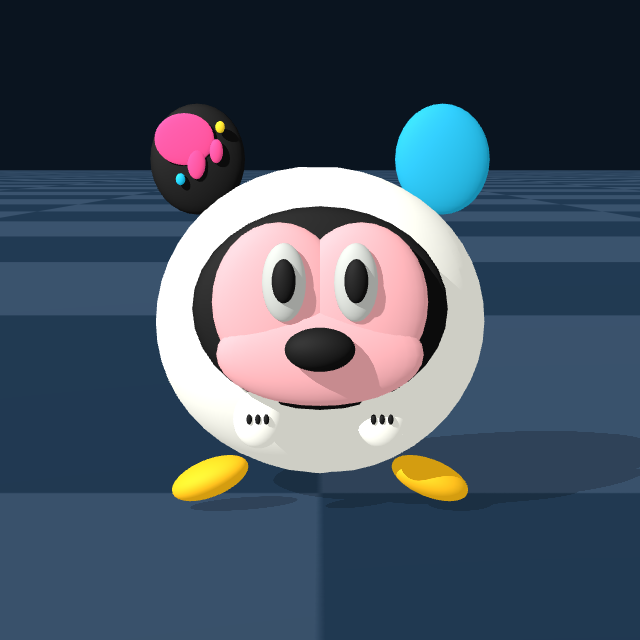

# Graffiti Mickey handover object: evidence and Real2Sim decision

> **Status:** the generated OBJ is a physics/debug proxy. It was built from
> procedural primitives and did not use COLMAP, VkSplat, 3DGS, or a learned
> image-to-3D model. It must not be presented as the final photorealistic
> Real2Sim appearance asset.

## Corrected identity

The historical handover target is the **Graffiti Mickey** variant from the
MINISO Disney **Mickey Fun Crash Series**. It is sold as a vinyl-plush pendant
or keychain blind box (`米奇有趣碰撞系列搪胶毛绒盲盒挂件`). The prior
`sock-ball` name described the round manipulation target but was not the retail
identity. Baymax and Tsum Tsum comparisons are retired.

The identification is no longer based on a single marketplace listing. The
user-confirmed listing is cross-checked against a continuous four-view listing,
the series catalog, a second boxed listing, an independent retailer, and the
private HIL frames. The content-hashed source and angle manifest is
`data/graffiti_mickey_reference_sources.json`. Source pixels remain outside the
public repository.

Primary references:

- user-confirmed exact variant and accessory views:
  <https://www.mercari.com/us/item/m24995712441/>;
- standard-variant front/right/rear/left views:
  <https://www.mercari.com/us/item/m60402675889/>;
- series name and `搪胶毛绒` construction:
  <https://stctoys.com/products/miniso-disney-mickey-fun-crash-series-blind-box>;
- independent series and feature cross-check:
  <https://pinecentre.com/buy/product/miniso-x-disney-mickey-mouse-fun-crash-series-plush-keychain-blind-box-1pc-showcase-c27a7d>;
- exact-variant box front:
  <https://www.mercari.com/us/item/m31210859832/>;
- reported two-graffiti-ear manufacturing error and the standard card:
  <https://www.reddit.com/r/MINISO/comments/1mvqc7t/mickey_fun_crash_graffiti/>.

The standard front-view layout is a black ear with pink paint drips on the
viewer-left and a cyan-blue ear on the viewer-right. A community photograph
with two graffiti ears is explicitly described by its owner as a manufacturing
error and is not used as the canonical geometry.

## Coverage and scale

The private web bundle contributes exact-variant front, right, rear, left,
front/top, top/keyring, tag, box, and catalog views. The historical dense HIL
export contributes 1,020 content-hashed images from 17 successful episodes,
two cameras, and in-hand deformation. Bottom coverage is partial, but the shoe
placement, body seam, and task videos constrain it well enough for a simulation
proxy.

The user-confirmed product specification gives a pendant height of
approximately 9.5 cm. The current asset therefore uses 95 ± 5 mm as its metric
scale anchor and a plush-body ellipsoid with semi-axes 42 × 38 × 39 mm. The
scale is also cross-checked against the SO-101 gripper in HIL. A later direct
measurement can tighten the uncertainty, but it is not a prerequisite for the
object reconstruction. The 40 g mass remains an unmeasured physical prior and
must not be reported as a measured material property.

## Asset partition

The object is not physically homogeneous:

1. a compressible off-white plush body;
2. rigid vinyl face surround, pink face plate, moving-eye housings, pupils and
   nose;
3. rigid vinyl ears, hands, and yellow shoes;
4. a flexible satin `MICKEY` strap and Mickey-head keyring.

`sim/genesis_so101/handover_asset.py` procedurally produces three traceable
physics/debug meshes from `configs/handover_object.json`:

- an accessory-free, colored debug visual for the real-time rigid scene;
- a closed plush-body mesh for collision and qualitative PBD tests;
- a display mesh that also includes the strap and keyring.

The visual is intentionally a geometry-and-color physics proxy, not a Disney
artwork redistribution and not a 3DGS reconstruction. No marketplace or
catalog pixels are embedded as textures. Its purpose is collision debugging,
object orientation, and solver integration; visual fidelity must come from a
separately captured Gaussian asset.

## Physics profiles

The real-time dual-arm task uses a rigid, convexified version of the
accessory-free visual. This preserves stable SO-101 contacts and the existing
haptic-feedback path while retaining the recognizable face, ears, hands, and
shoes. The flexible strap and keyring are omitted from collision because they
would create thin, high-frequency contact features unrelated to the handover.

A separate Genesis `PBD.Elastic` smoke test uses only the closed plush-body
mesh. It is a solver-feasibility profile, not a complete hybrid rigid-soft
assembly: the vinyl inserts are excluded and the current compliance values are
uncalibrated. A complete hybrid model would need rigid-to-PBD attachment
constraints and a measured compression curve.

The next optional physical calibration is direct mass plus three orthogonal
body dimensions, followed by force at 0, 5, 10, 15, and 20 mm compression.
These measurements can tighten the product-spec scale and fit PBD compliance;
they are not a gate for the appearance pipeline.

## Corrected-asset AMD validation

The final standard-ear asset was validated on `ssh amd` with Genesis 1.3.1,
the `gs.amdgpu` backend, and the APU's `gfx1150` Radeon. All runs are explicitly
nonformal and all recorded hashes pass:

- `20260804T025126Z_131467_amd_graffiti_mickey_preview`: fixed canonical-front
  visual/material QA, 640 × 640. It confirms viewer-left graffiti ear,
  viewer-right blue ear, pink face, moving-eye proxies, white plush body, hands,
  and yellow shoes. Visual mesh SHA-256:
  `59184e336677ac80f9d154f46b668db2208e36620c5fc6fb83cacd6e47dd2876`.
- `20260804T025212Z_132785_amd_graffiti_mickey_integration`: the corrected
  visual built in the parallel dual-SO-101 scene and stepped 120 times. Both
  640 × 480 observations were produced, gripper saturation stayed at zero,
  and mean/p95 step time was 7.386/4.345 ms. The mean includes compilation and
  render outliers; this joint sweep is not a handover success evaluation.
- `20260804T025240Z_132784_amd_soft_object`: the closed plush-body mesh built as
  1,303 PBD particles and stepped 120 times. Mean/p95 step time was
  4.181/5.210 ms. Collision mesh SHA-256:
  `8bea640b0222b2dbbf5e20c249608c35fce8dbedbdef2fc4315979a47f8c404d`.
  Compliance remains uncalibrated, so compression values are engineering
  diagnostics rather than material claims.

## Historical AMD runs

The 2026-08-04 `amd_soft_object`, `amd_object_integration`, and
`amd_object_haptic_smoke` runs validated the earlier generic ellipsoid and the
Genesis/AMD execution paths. They remain preserved as nonformal engineering
history, but they do **not** validate the corrected Graffiti Mickey geometry.
New corrected-asset runs must receive new manifests, hashes, and `formal: false`
labels on `ssh amd`.
