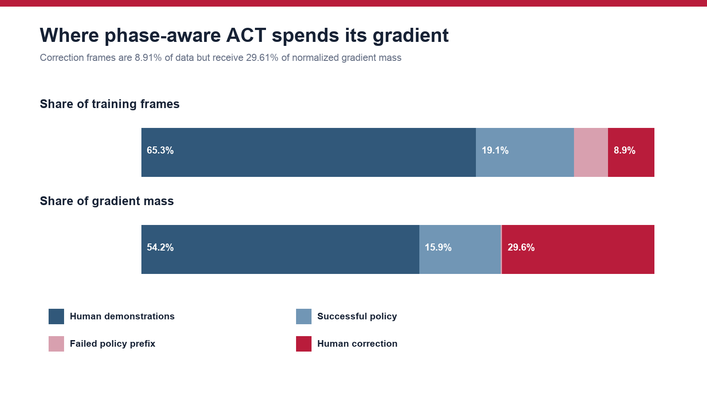
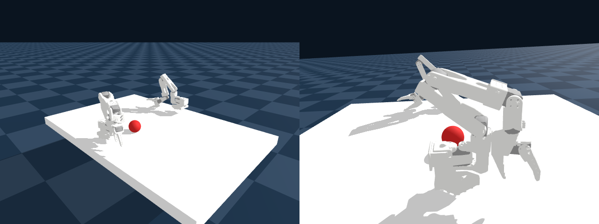
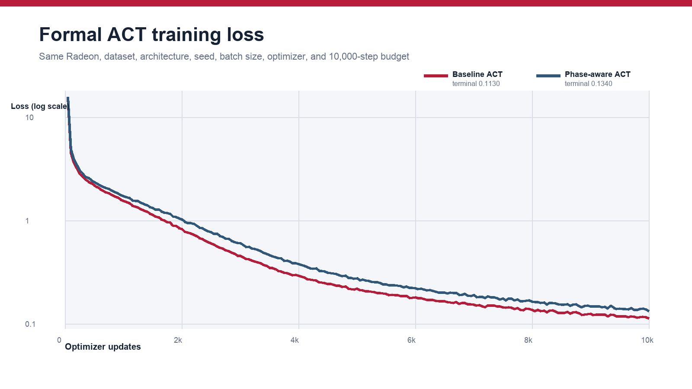
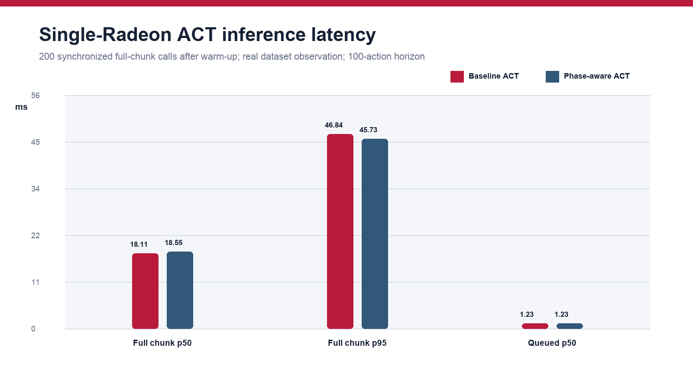
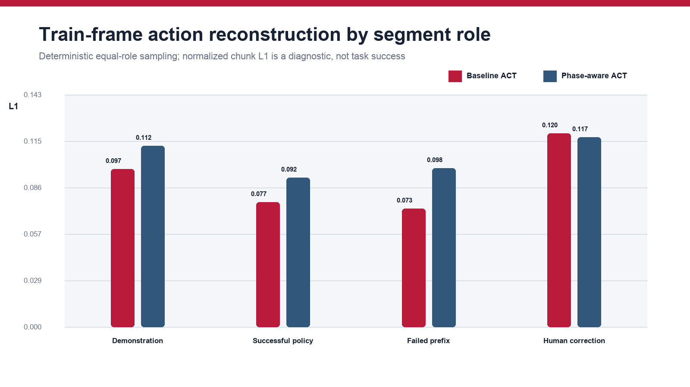

# Radeon OneLoop

## A Staged Real2Sim2Real Loop for Bimanual Handover

**AMD Radeon Hackathon 2026 — Track 3: Physical AI**

**Team:** Phi Media Lab

**Formal profile:** one AMD Radeon `gfx1100`, ROCm 7.2.1

**Report status:** complete; every result below is backed by a registered,
immutable single-Radeon run record.

## Abstract

Radeon OneLoop is a staged Real2Sim2Real system for a difficult SO-101
bimanual handover. It joins two auditable evidence chains around the same
physical cell and team-owned plush object. The first is real -> learn -> real:
84 demonstrations and 40 reviewed policy/HIL episodes feed a fair,
single-Radeon comparison between uniform and correction-aware ACT, followed by
ROCm inference and physical deployment. The second is real -> sim: real object
photographs become a metrically canonicalized TRELLIS.2 appearance asset,
while a Torch/ROCm MGPBD implementation drives an exact custom-vertex bridge
into the Genesis AMD renderer.

The competition boundary is intentionally strict. A single Radeon `gfx1100`
executes the Genesis environment, both model-training jobs and policy
inference. The CPU performs decoding, camera and robot I/O, validation,
watchdog and emergency-stop duties only. Every accelerator job is tied to a
GPU UID, immutable source commit, config hash, dataset hash, seed and raw
evidence directory. The real dataset contains 124 episodes and 178,465 frames;
15,906 are reviewed intervention/correction frames. The formal dataset is
train-only, so this report separates training-set diagnostics from task
success. A reviewed 37/45 real-robot result is included only as historical
evidence for the inherited closed-loop system, never as performance of the new
formal checkpoints.

Under the predeclared step-10,000 rule, phase-aware ACT reduced normalized
chunk L1 on sampled correction frames from 0.11957 to 0.11712 (2.05%), while
the equal-role aggregate worsened from 0.09177 to 0.10479 (14.19%). This mixed
train-frame diagnostic is consistent with reallocating capacity toward
corrections, but it is neither validation nor task-success evidence. Full
100-action chunk median latency was 18.11 ms for baseline and 18.55 ms for
phase-aware ACT on the same Radeon.

The Real2Sim branch is reported with a separate development boundary.
TRELLIS.2 generation used the official hosted endpoint; the Radeon receipt
covers metric preparation and Genesis execution, not TRELLIS.2 inference.
MGPBD run `T152831` validates coherent closed-boundary checkpoint replay into
Genesis on AMD using the clean `bunny_small` volume. It does not establish full
P0a2 convergence, realtime dynamics, gripper contact, or a deformable doll.
Those are the next controlled sim-to-real experiment rather than hidden
claims in this report.

## Real2Sim2Real framing

```text
physical demonstrations + HIL corrections
          -> 124-episode immutable dataset
          -> baseline / phase-aware ACT on one Radeon
          -> ROCm inference + CPU safety edge
          -> physical handover-to-place

reviewed real photographs of the team-owned object
          -> TRELLIS.2 textured appearance
          -> measured 95 mm canonical frame
          -> ROCm MGPBD state
          -> Genesis AMD state bridge
          -> simulated intervention curriculum (next evaluation)
          -> same policy and safety interfaces
```

The first path is the formal competition result. The second validates the
appearance, metric, solver, and renderer interfaces needed to close the future
sim-to-real loop. Keeping these statuses separate makes the combined system
stronger: a reviewer can reproduce what passed and identify exactly what is
still experimental.

## 1. Problem and motivation

Bimanual handover combines perception, long-horizon coordination and contact.
The receiving arm must arrive while the giving arm still stabilizes the
object; release must occur only after a reliable grasp; and a small error early
in the sequence can become an irrecoverable drop. These characteristics make
the task a useful test of whether human interventions can be turned into
targeted learning signal rather than simply appended to a dataset.

The physical platform consists of two six-command SO-101 arms and two RGB
cameras. Each policy observation contains the 12 joint/gripper values plus a
front and hand camera image. Each action contains five joint commands and one
gripper command for the left arm followed by the same six commands for the
right arm. The control contract is 30 Hz. ACT generates chunks of 100 actions,
allowing the edge process to dispatch queued actions while the next chunk is
computed.

The object and target vary less than they would in an unconstrained household
setting. This is deliberate: the entry studies reliable phase transitions and
intervention learning in a complete real pipeline, rather than claiming
general-purpose manipulation.

## 2. Compliance and system architecture

### 2.1 One-card boundary

The formal host exposes one ROCm agent and one PyTorch device:

| Item | Formal value |
|---|---|
| ROCm / HIP | 7.2.1 / 7.2.53211 |
| PyTorch | 2.9.1+rocm7.2.1 |
| Genesis | 1.3.1, `gs.amdgpu` |
| Target | `gfx1100` |
| Reported name | AMD Radeon Graphics |
| GPU UID | `0x153f7d55778ab659` |
| VRAM | 51,522,830,336 bytes (47.98 GiB) |
| Visible accelerator count | 1 |

PyTorch uses its CUDA-compatible Python namespace for ROCm devices. Therefore
Genesis/PyTorch logs can display `cuda:0` even though the underlying runtime is
HIP. The simultaneous `torch.version.hip`, `gfx1100`, AMD device name, ROCm
UID and dependency audit establish that this is the Radeon device; the
bootstrap rejects NVIDIA packages and no CUDA runtime is present.

The same device executes:

1. Genesis scene build, rigid-body stepping and camera rendering;
2. ACT baseline training;
3. phase-aware ACT training; and
4. full-chunk ACT inference and queued-action dispatch.

`radeon-f` is an equivalent but distinct shadow GPU used to fail fast on clean
environment and two-step smoke tests. A Radeon APU machine and an MI300X
machine were inspected for prior work only. Their checkpoints, frame rates and
training results are forbidden formal sources.

### 2.2 Runtime split

```text
                         one Radeon gfx1100
              +----------------------------------+
              | Genesis AMD environment          |
              | ACT baseline + phase-aware train |
              | ACT chunk inference              |
              +----------------+-----------------+
                               |
             observation ID / action chunk / timestamps
                               |
              +----------------v-----------------+
              | CPU edge                          |
              | cameras, joint I/O, limits        |
              | watchdog, timeout, physical E-stop|
              +----------------+-----------------+
                               |
                        two SO-101 arms
```

The CPU is not an alternative inference path. The formal profile explicitly
prohibits CUDA, an NPU, a second GPU, a software renderer and remote inference
APIs.

### 2.3 Evidence discipline

Every GPU command runs under an exclusive file lock. The launcher asserts one
PyTorch device, a `gfx1100` architecture and the expected formal UID. It then
writes the exact command, environment freeze, hardware record, configuration,
one-second ROCm samples, stdout/stderr, metrics, hashes and `DONE` or `FAILED`.
Failed and aborted runs are retained. Only registered runs may populate result
tables.

## 3. Data and contracts

### 3.1 Sources

The immutable dataset builder merges two team-collected sources without
mutating either:

| Source | Episodes | Frames | Role |
|---|---:|---:|---|
| Human behavior demonstrations | 84 | 116,550 | Train |
| Reviewed HIL policy rollouts | 40 | 61,915 | Train |
| **Combined** | **124** | **178,465** | **Train only** |

The builder verifies two `480 × 640 × 3` RGB streams, the 30 Hz rate, the
12-value action and state order, task tables, video references, contiguous
episode indices and exact HIL manifest coverage. It emits a file-level SHA-256
ledger and refuses to overwrite a prior output. The resulting dataset hash is:

```text
ba18dd207ffd00c562a7ad18c831508d0529cd4d8d7b478a9b2f6d46618489cf
```

The raw dataset is access-controlled because it contains team-recorded robot
video and has not been cleared for public redistribution. The schema, builder,
source hashes and derived hashes are public.

### 3.2 Action and observation contract

The frozen action order is:

```text
left:  shoulder_pan, shoulder_lift, elbow_flex, wrist_flex, wrist_roll, gripper
right: shoulder_pan, shoulder_lift, elbow_flex, wrist_flex, wrist_roll, gripper
```

Real revolute joints are expressed in degrees, while the gripper uses closed =
0 and open = 100. The Genesis adapter converts revolute joints to radians and
maps the gripper monotonically into the model joint range. Round-trip and
ordering tests run without robotics or ML dependencies.

### 3.3 Intervention labels

The 40 HIL episodes were human-reviewed. Successful policy frames receive the
ordinary behavior weight. In failed episodes, explicit correction intervals
identify where the operator took over; the preceding autonomous segment is
labeled as a failed policy prefix.

| Role | Frames | Raw weight | Normalized gradient-mass share |
|---|---:|---:|---:|
| Behavior demonstration | 116,550 | 1.00 | 54.24% |
| Successful policy | 34,101 | 1.00 | 15.87% |
| Failed policy prefix | 11,908 | 0.05 | 0.28% |
| Human correction | 15,906 | 4.00 | 29.61% |



Weights are normalized over positive frames so the positive mean is one. This
keeps the overall loss scale comparable while changing which frames dominate
the gradient. The sidecar hash is:

```text
b34f5559db6d697890a08b6a7e49b52f3a916537c3328aea72c8470bb90bec57
```

## 4. Genesis environment

The simulation component is deliberately minimal. It downloads and verifies
the official SO-101 MJCF and mesh assets, instantiates two arms, a table, a
rigid object and two cameras, and exposes the same state and image keys as the
real dataset. It includes reset, position control, deterministic stepping,
attached-camera motion and an explicit placement predicate.

The camera-corrected formal smoke ran 1,000 steps on `gs.amdgpu`, exercised
both arms, rendered the front and attached hand camera, and validated finite
12-value state. Scene build took 33.84 s. The recorded all-step latency,
including the capture steps, was:

| Statistic | Time |
|---|---:|
| Median | 4.27 ms |
| p95 | 5.02 ms |
| p99 | 7.02 ms |



The scripted motion is a build/control/camera test and does not execute a
learned handover; `task_success=false` is recorded in the formal metrics. The
earlier formal scene run remains public but its hand-camera image is excluded
from visual claims after the relative camera transform was corrected.

## 5. Policy method

### 5.1 Baseline

The baseline is the default LeRobot ACT architecture (51.6 million parameters
in the smoke evidence), initialized randomly and trained on every frame with
uniform sample contribution. Its role is a reproducible control, not a
historical checkpoint.

### 5.2 Phase-aware ACT

The phase-aware model uses the same architecture, random initialization,
observations, action targets, optimizer defaults, batch size, worker count,
seed and 10,000-step budget. Only the per-frame ACT loss weighting changes.
The patched training path looks up each sampled dataset index in the immutable
sidecar, applies the weight to the per-item loss and normalizes nonzero batch
weights. A startup audit reports coverage and weight statistics before the
first optimizer update.

The design encodes a simple hypothesis: the short human correction after a
failure contains more information about recovery and transition timing than a
long autonomous prefix already known to be unsuccessful. Weighting avoids
duplicating frames and preserves an exact baseline comparison.

### 5.3 Selection rule

The dataset has no held-out validation split, and the Genesis scene is not a
calibrated replica suitable for choosing a real-task checkpoint. We therefore
predeclared the final checkpoint at step 10,000 as the only candidate for each
method. Checkpoints saved every 1,000 steps remain debugging artifacts and are
not searched after observing loss.

### 5.4 Key technical contributions

- a deterministic frame-level intervention objective that plugs into ACT
  without changing its architecture or duplicating training samples;
- a matched real/sim observation and action contract for two SO-101 arms,
  including a moving hand-camera transform verified on `gs.amdgpu`;
- a fail-closed single-Radeon job protocol that makes hardware identity,
  source, data, configuration and final model content independently auditable;
  and
- a CPU-edge chunk protocol whose timeout, sequence, range and delta checks
  latch E-stop before unsafe values reach robot I/O.

## 6. CPU-edge safety

The dependency-free safety controller uses monotonically increasing sequence
IDs and monotonic-clock timestamps. Before any chunk can reach robot I/O it
requires:

- an armed, non-latched controller;
- a current observation and command;
- exact observation/action sequence correspondence;
- a non-empty, finite 12-DoF action chunk;
- joint and gripper values inside configured limits; and
- per-joint delta below the configured bound.

A stale observation, stale command, reordered packet, mismatch or limit
violation latches E-stop. Software recovery is not permitted: a new controller
must be created after physical reset. These checks supplement rather than
replace manufacturer safety limits, workspace clearance and an operator with
access to the physical stop.

## 7. Evaluation protocol

### 7.1 Training and runtime measurements

Both formal runs use the same machine, dataset hash, seed, batch size and
training budget. We report elapsed wall time, terminal training loss,
checkpoint hash and externally sampled peak GPU memory. These are systems and
optimization measurements, not robot-success estimates.

For inference, a real dataset observation is decoded into the same camera and
state dictionary used at runtime. After 20 warm-up calls, 200 synchronized
full-chunk calls measure model execution plus preprocessing/postprocessing.
The policy is then invoked without reset to measure queued action dispatch.
The report includes mean, median, p95 and p99 latency, action shape, finiteness,
chunk horizon and peak allocated VRAM.

### 7.2 Action reconstruction diagnostic

The evaluator selects up to 256 evenly spaced frame indices from each segment
role. It compares the predicted normalized ACT action chunk and the first
action against dataset targets. Selection is deterministic and identical for
both checkpoints. Because all samples are training frames, the values are
reported as reconstruction diagnostics only. They cannot estimate
generalization or closed-loop task success.

### 7.3 Real-robot boundary

The source project contains a complete physical perception-policy-control
loop. A prior reviewed 45-episode batch recorded 37 successes and eight
`handover_failed` outcomes (82.22%). Hashes of the run, annotations, action log,
launch ledger and checkpoint were captured from a read-only evidence host.
That checkpoint predates this formal experiment and is neither a parent nor a
result. No success rate for the new checkpoints is claimed without new,
supervised physical rollouts.

## 8. Formal results

### 8.1 Environment

| Run | Result | Formal evidence |
|---|---|---|
| ROCm/PyTorch/Genesis clean bootstrap | PASS | one `gfx1100`, AMD matmul, `gs.amdgpu`, Vulkan enumeration |
| Dataset build | PASS | 124 episodes, 178,465 frames, exact derived hash |
| Genesis dual-arm smoke | PASS | 1,000 steps, two cameras, 12-value state |

### 8.2 Paired ACT experiment

| Metric | Baseline ACT | Phase-aware ACT |
|---|---:|---:|
| Updates | 10,000 | 10,000 |
| Training wall time | 87.75 min | 87.68 min |
| Terminal logged training loss | 0.113 | 0.134 |
| Mean sampled GPU utilization | 98.59% | 98.45% |
| Peak sampled VRAM allocation | 17% (≤ 8.16 GiB) | 17% (≤ 8.16 GiB) |
| Step-10,000 checkpoint SHA-256 | `7c8f2089…29dc79` | `3ae18054…2721d4` |

The complete artifact-tree digests are:

```text
baseline    7c8f2089c2f9ff5632ab1272754bdece46e30280ffce6c8ecde850956429dc79
phase-aware 3ae1805441889adf3fcaa23ff45e79509f0be747619c2783227014bc162721d4
```

The logged losses are optimized under different frame-weight distributions.
They document convergence but are not an accuracy ranking.



### 8.3 Inference and reconstruction

| Metric | Baseline ACT | Phase-aware ACT |
|---|---:|---:|
| Full 100-action chunk, median | 18.11 ms | 18.55 ms |
| Full chunk, p95 | 46.84 ms | 45.73 ms |
| Queued action dispatch, median | 1.233 ms | 1.233 ms |
| Peak allocated inference VRAM | 377.8 MiB | 377.8 MiB |
| Equal-role normalized chunk L1 | **0.09177** | 0.10479 |
| Correction normalized chunk L1 | 0.11957 | **0.11712** |
| Correction normalized first-action L1 | **0.09009** | 0.09626 |





### 8.4 Interpretation

The phase-aware checkpoint improved the metric it explicitly emphasized:
correction-frame chunk L1 decreased 2.05%. The cost is visible rather than
hidden: the equal-role aggregate worsened 14.19%, demonstration L1 rose from
0.09745 to 0.11187, successful-policy L1 from 0.07705 to 0.09213, and failed-
prefix L1 from 0.07301 to 0.09805. Correction first-action L1 also worsened
6.85%, so the small correction gain is distributed over the predicted chunk,
not its immediate action. This supports a capacity-reallocation interpretation
but does not establish better closed-loop recovery. No table value comes from
a shadow host, smoke checkpoint, MI300X, APU/NPU, post-hoc checkpoint choice or
unregistered directory.

## 9. Negative results and scope decisions

### 9.1 Gaussian workspace twin

We evaluated adding a Vulkan/RADV Gaussian workspace representation through
VkSplat. Existing machines contained a corgi example, synthetic cameras and
unrelated 3D/4D Gaussian research, but not a calibrated static multi-view
capture of the competition SO-101 workspace. Substituting those assets would
make an attractive demo without demonstrating the same task. The branch was
therefore gated out before formal optimization. Its hash-pinned runner and
capture schema remain as reproducible future work, but Gaussian output is not
an observation, result or claimed contribution in this release.

### 9.2 Aborted checkpoint-selection run

An initial formal baseline was stopped at step 250 after discovering that its
configuration text described fixed validation seeds even though the dataset
has no validation split. The run remains marked failed. Before restarting, the
selection rule was changed to the predeclared final training step and covered
by a regression test. Preserving this negative run is part of the evidence
policy.

### 9.3 General limitations

- The formal dataset is train-only and cannot quantify generalization.
- The Genesis scene verifies AMD execution and interfaces but is not a
  calibrated sim-to-real benchmark.
- Historical physical success does not measure either new checkpoint.
- Raw team video cannot be redistributed, limiting one-command external data
  reproduction; authorized reviewers can reproduce from registered hashes.
- The task is constrained to one object family and workspace.
- The CPU-edge safety kernel has unit tests but no safety certification.

## 10. Reproducibility and final deliverables

The final output forms are this English PDF technical report, the dedicated
Apache-2.0 source repository and detailed root README, a public 3-5 minute
H.264/AAC workflow video, machine-readable formal evidence, and the official
competition pull request. The public repository contains:

- exact environment and dependency bootstraps with wheel/source hashes;
- immutable data merger, phase-target builder and public source/derived hashes;
- frozen baseline, phase-aware and single-Radeon configurations;
- a hash-verified SO-101 Genesis asset fetcher and minimal scene;
- fair-pair checks and exact LeRobot command generation;
- latency, reconstruction and safety evaluators;
- job manifests, GPU sampling, terminal markers and SHA-256 ledgers; and
- unit and shell validation invoked by `./ops/validate_scaffold.sh`.

The root README gives clean-clone commands and makes the access-controlled data
boundary explicit. Project code is Apache-2.0; dependency and asset status is
listed in `THIRD_PARTY_NOTICES.md`.

## 11. Upstream community contribution

During the competition we filed
[Genesis issue #3163](https://github.com/Genesis-Embodied-AI/genesis-world/issues/3163)
to improve the project's AMD support path. The checked-in
`docker/Dockerfile.amdgpu` still describes a ROCm 6.4.1 / PyTorch 2.6 /
Genesis 0.2.1-era target, while Radeon OneLoop provides public native-host
evidence for ROCm 7.2.1, AMD PyTorch 2.9.1 and Genesis 1.3.1 on `gfx1100`.
The report proposes an explicit supported tuple, pinned compatibility-sensitive
packages and a `gs.amdgpu` scene smoke. It also states that we did not build the
current Dockerfile, avoiding an unverified container claim. A code PR is
offered once maintainers select the intended base-image tag.

## 12. Team contribution

**Baoshu Feng, Phi Media Lab** - project and experiment design; SO-101 data and
HIL workflow integration; intervention-target methodology; Radeon/ROCm
bring-up; Genesis environment; formal training and evaluation; CPU-edge safety;
evidence, report, and submission engineering.

The underlying robot collection and reviewed HIL artifacts were produced in
Phi Media Lab's prior real-robot workflow. Upstream Genesis, PyTorch, ROCm,
LeRobot and SO-101 assets remain credited to their respective authors.

## References

1. AMD-DEV-CONTEST,
   [Radeon Hackathon 2026-07 official repository](https://github.com/AMD-DEV-CONTEST/Radeon-hackathon-2026-07).
2. Genesis Authors,
   [Genesis source and documentation](https://github.com/Genesis-Embodied-AI/genesis-world),
   version 1.3.1.
3. Zhao et al.,
   [Learning Fine-Grained Bimanual Manipulation with Low-Cost Hardware](https://arxiv.org/abs/2304.13705),
   ACT / ALOHA.
4. Hugging Face, [LeRobot](https://github.com/huggingface/lerobot).
5. AMD,
   [ROCm Radeon documentation](https://rocm.docs.amd.com/projects/radeon-ryzen/en/latest/)
   and official PyTorch wheels.
